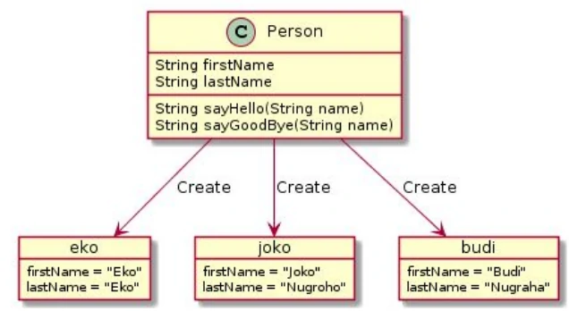
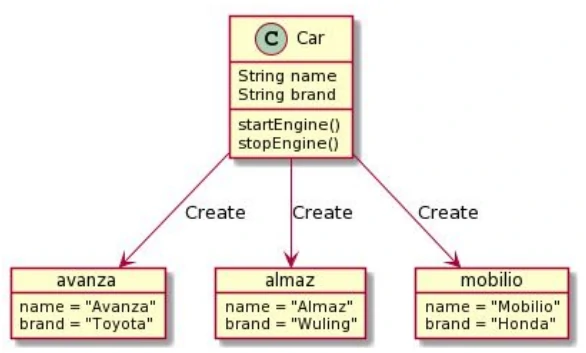

# Pengenalan OOP

## Apa itu Object Oriented Programming?

- Object Oriented Programming adalah sudut pandang bahasa pemrograman yang berkonsep “objek”
- Ada banyak sudut pandang bahasa pemrograman, namun OOP adalah yang sangat populer saat ini.
- Ada beberapa istilah yang perlu dimengerti dalam OOP, yaitu: Object dan Class

---

## Apa itu Object?

- Object adalah data yang berisi field / properties / attributes dan method / function / behavior

---

## Apa itu Class?

- Class adalah blueprint, prototype atau cetakan untuk membuat Object
- Class berisikan deklarasi semua properties dan functions yang dimiliki oleh Object
- Setiap Object selalu dibuat dari Class
- Dan sebuah Class bisa membuat Object tanpa batas

---

## Class dan Object : Person

---

## Class dan Object : Car

