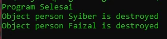

# Destructor

## Destructor

- Jika constructor adalah function yang akan dipanggil ketika object dibuat
- Destructor adalah function yang akan dipanggil ketika object dihapus dari memory
- Biasanya ketika object tersebut sudah tidak lagi digunakan, atau ketika aplikasi akan mati
- Untuk membuat function destructor, kita bisa menggunakan nama function __destruct()
- Khusus untuk destructor, kita tidak boleh menambahkan function argument
- Dalam penggunaan sehari-hari, ini misal cocok untuk menutup koneksi ke database atau menutup proses menulis ke file, sehingga tidak terjadi memory leak

---

## Kode : Destructor

*Data/Person,php*
```php
<?php

class Person
{
    const AUTHOR = "Program Is Fun";

    var string $name;
    var ?string $address = null;
    var string $country = "Indonesia";

    function __construct(string $name, ?string $address)  {
        $this->name = $name;
        $this->address = $address;
    }

    function sayHello(?string $name)
    {
        if(is_null($name)) {
            echo "Hi, my name is $this->name" . PHP_EOL;
        } else {
            echo "Hello $name, my name is $this->name" . PHP_EOL;
        }
    }

    function info() {
        echo "Author : " . self::AUTHOR . PHP_EOL;
    }

    function __destruct() {
        echo "Object person $this->name is destroyed" . PHP_EOL;
    }
}
```

*Faizal.php*
```php
<?php

require_once "data/Person.php";

$faizal = new Person("Faizal", "Sukoharjo");
$syiber = new Person("Syiber", "Greenland");

echo "Program Selesai" . PHP_EOL;
```

**Hasil :**

