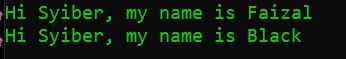

# Inheritance

## Inheritance
- Inheritance atau pewarisan adalah kemampuan untuk menurunkan sebuah class ke class lain
- Dalam artian, kita bisa membuat class Parent dan class Child
- Class Child, hanya bisa punya satu class Parent, namun satu class Parent bisa punya banyak class 
  
---

## Child

- Saat sebuah class diturunkan, maka semua properties dan function yang ada di class Parent, secara otomatis akan dimiliki oleh class Child
- Untuk melakukan pewarisan, di class Child, kita harus menggunakan kata kunci extends lalu diikuti dengan nama class parent nya.

---

## Kode : Inheritance

*Data/Manager.php*
```php
<?php 

class Manager
{
    var string $name;

    // void = memberitahu bahwa function ini tidak mengembalikan nilai
    function sayHello(string $name): void {
        echo "Hi $name, my name is $this->name" . PHP_EOL;
    }
}

class VidePresident extends Manager{

}
```
---

## Kode : Mengakses Method Parent

*Inheritance.php*
```php
<?php

require_once "data/Manager";

$manager = new Manager();
$manager->name = "Faizal";
$manager->sayHello("Syiber");

$vp = new VicePresident();
$vp->name = "Black";
$vp->sayHello("Syiber");
```

**Hasil :**

