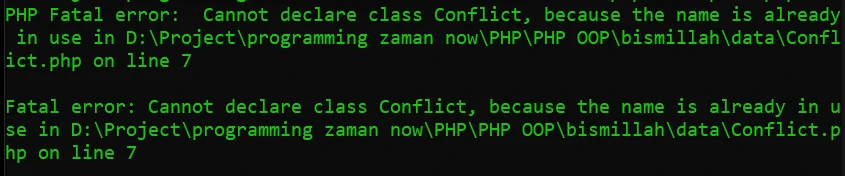

# Namespace

## Namespace
- Saat kita membuat aplikasi, bisa dipastikan kita akan banyak sekali membuat class
- Jika class terlalu banyak, kadang akan menyulitkan kita untuk mencari atau mengklasifikasikan jenis-jenis class
- PHP memiliki fitur namespace, dimana kita bisa menyimpan class-class kita di dalam namespace
- Namespace bisa nested, dan jika kita ingin mengakses class yang terdapat di namespace, kita perlu menyebutkan nama namespace nya
- Namespace bagus ketika kita punya beberapa class yang sama, dengan menggunakan namespace nama class sama tidak akan menjadikan error di PHP

---

## Kode : Tanpa Namespace

*Conflict.php*

```php
<?php

class Conflict {

}

class Conflict {
    
}
```

*Namespace.php*
```php
<?php

require_once "data/Conflict.php"
```

> Error

**Hasil :**


---

## Membuat Namespace

- Untuk membuat namespace, kita bisa menggunakan kata kunci namespace
- Jika kita ingin membuat sub namespace, kita cukup gunakan karakter \ setelah namespace sebelumnya

---

## Kode : Membuat Namespace

*Data/Conflict/php*
```php
<?php

// namespace Data\One;
// artinya semua clas berada di namespace Data\One

namespace Data\One {
    class Conflict {
        
    }
}

namespace Data\Two {
    class Conflict {
        
    }
}
```

**Hasil :**


---

## Kode : Membuat Object dari Namespace

*Namespace.php*
```php
<?php

require_once "data/Conflict.php";

$conflict1 = new Data\One\Conflict();
$conflict2 = new Data\One\Conflict();
```

---

## Function dan Constant di Namespace

- Selain class, kita juga menggunakan function dan constant di namespace
- Dan jika kita ingin menggunakan function atau constant tersebut, kita bisa menggunakannya dengan diawali dengan nama namespace nya

---

## Kode : Function dan Constant di Namespace

*data/Helper.php*
```php
<?php

namespace Helper;

function helpMe() {
    echo "HELP ME" . PHP_EOL;
}

const APPLICATION = "Belajar PHP OOP";
```

*Namespace.php*
```php
<?php

require_once "data/Conflict.php";
require_once "data/Helper.php";

$conflict1 = new Data\One\Conflict();
$conflict2 = new Data\One\Conflict();

echo Helper\APPLICATION . PHP_EOL;
Helper\helpMe();
```

**Hasil :**


---

## Global Namespace

- Secara default saat kita membuat kode di PHP sebenarnya itu disimpan di global namespace
- Global namespace adalah namespace yang tidak memiliki nama namespace

---

## Kode : Global Namespace

*Namespace.php*
```php
<?php

require_once "data/Conflict.php";
require_once "data/Helper.php";

$conflict1 = new Data\One\Conflict();
$conflict2 = new Data\One\Conflict();

echo Helper\APPLICATION . PHP_EOL;
Helper\helpMe();
```

> Sebenarnya seperti ini

```php
<?php

namespace {
    require_once "data/Conflict.php";
    require_once "data/Helper.php";

    $conflict1 = new Data\One\Conflict();
    $conflict2 = new Data\One\Conflict();

    echo Helper\APPLICATION . PHP_EOL;
    Helper\helpMe();
}
```

> jika tidak membuat namespace, defaultnya seperti ini
> tidak akan error dan hasilnya sama saja