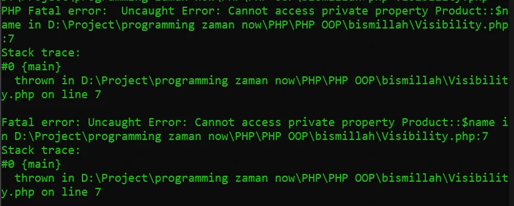
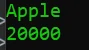

# Visibility

## Visibility
- Visibility / Access modifier adalah kemampuan properties, function dan constant dapat diakses dari mana saja
- Secara default, properties, function dan constant yang kita buat di dalam class bisa diakses dari mana saja, atau artinya dia adalah public
- Selain public, masih ada beberapa visibility lainnya
- Secara default kata kunci var untuk properties adalah sifatnya public

---

## Access Level

<table border="1" width="100%">
    <tr>
        <th>Modifier</th>
        <th>Class</th>
        <th>Subclass</th>
        <th>World</th>
    </tr>
    <tr>
        <td>public</td>
        <td>Y</td>
        <td>Y</td>
        <td>Y</td>
    </tr>
    <tr>
        <td>protected</td>
        <td>Y</td>
        <td>Y</td>
        <td>N</td>
    </tr>
    <tr>
        <td>private</td>
        <td>Y</td>
        <td>N</td>
        <td>N</td>
    </tr>
</table>

---

## Kode : Class Product Dan Visibility Private

*Product.php*
```php
<?php

class Product {
    private string $name;
    private int $price;

    public function __construct(string $name, int $price) {
        $this->name = $name;
        $this->price = $price;
    }
}
```

*Visibility.php*
```php
<?php

require_once "data/Product.php";

$product = new Product("Apple", 20000);

echo $product->name . PHP_EOL;
```

> Error

**Hasil :**



### BERHASIL 

*Product.php*
```php
<?php

class Product {
    private string $name;
    private int $price;

    public function __construct(string $name, int $price) {
        $this->name = $name;
        $this->price = $price;
    }

    public function getName(): string {
        return $this->name;
    }

    public function getPrice(): int {
        return $this->price;
    }
}
```

*Visibility.php*
```php
<?php

require_once "data/Product.php";

$product = new Product("Apple", 20000);

echo $product->getName() . PHP_EOL;
echo $product->getPrice() . PHP_EOL;
```

**Hasil :**



---

## Kode : Class Product Dan Visibility Protect

*Product.php*
```php
<?php

class Product {
    protected string $name;
    protected int $price;

    public function __construct(string $name, int $price) {
        $this->name = $name;
        $this->price = $price;
    }

    public function getName(): string {
        return $this->name;
    }

    public function getPrice(): int {
        return $this->price;
    }
}

class ProductDummy extends Product {
    public function info() {
        echo "Name $this->name" . PHP_EOL;
        echo "Name $this->price" . PHP_EOL;
    }
}
```

*Visibility.php*
```php
<?php

require_once "data/Product.php";

$dummy = new ProductDummy("Dummy", 1000);
$dummy->info();
```

**Hasil :**

