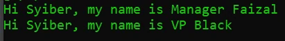

# Function Overriding

## Function Overriding

- Function overriding adalah kemampuan mendeklarasikan ulang function di child class, yang sudah ada di parent class
- Saat kita melakukan proses overriding tersebut, secara otomatis ketika kita membuat object dari class child, function yang di class parent tidak bisa diakses lagi

---

## Kode : Method Overriding

*data/Manager.php*
```php
<?php 

class Manager
{
    var string $name;

    function sayHello(string $name): void {
        echo "Hi $name, my name is Manager $this->name" . PHP_EOL;
    }
}

class VicePresident extends Manager{
    function sayHello(string $name): void {
        echo "Hi $name, my name is VP $this->name" . PHP_EOL;
    }
}
```

---

## Kode : Mengakses Function Overriding

*FunctionOverridding.php*
```php
<?php

require_once "data/Manager.php";

$manager = new Manager();
$manager->name = "Faizal";
$manager->sayHello("Syiber");

$vp = new VicePresident();
$vp->name = "Black";
$vp->sayHello("Syiber");

```

**Hasil :**

