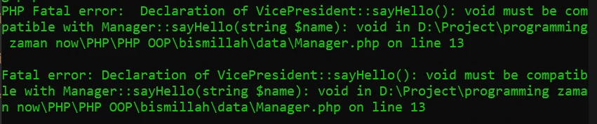

# Constructor O\verriding

## Constructor Overriding

- Karena constructor sama seperti function, maka constructor-pun bisa kita deklarasikan ulang di class Child nya
- Sebenarnya di PHP, kita bisa meng-override function dengan arguments yang berbeda, namun sangat tidak disarankan
- Jika kita melakukan override function dengan arguments berbeda, maka PHP akan menampilkan WARNING
- Namun berbeda dengan constructor overriding, kita boleh meng-override dengan mengubah arguments nya, namun direkomendasikan untuk memanggil parent constructor

---

## Kode : Merubah Arguments Overriding

*data/Manager.php*
```php
<?php 

class Manager
{
    var string $name;

    function sayHello(string $name): void {
        echo "Hi $name, my name is Manager $this->name" . PHP_EOL;
    }
}

class VicePresident extends Manager{
    function sayHello(): void {
        echo "Hi, my name is VP $this->name" . PHP_EOL;
    }
}
```

*FunctionOverringding.php*
```php
<?php

require_once "data/Manager.php";

$manager = new Manager();
$manager->name = "Faizal";
$manager->sayHello("Syiber");

$vp = new VicePresident();
$vp->name = "Black";
$vp->sayHello();
```

> Error

**Hasil :**


---

## Kode : Constructor Overriding (1)

*data/Manager.php*
```php
<?php 

class Manager
{
    var string $name;
    var string $title;

    public function __construct(string $name = "", string $title = "Manager") {
        $this->name = $name;
        $this->title = $title;
    }

    function sayHello(string $name): void {
        echo "Hi $name, my name is Manager $this->name" . PHP_EOL;
    }
}

class VicePresident extends Manager{
    function sayHello(string $name): void {
        echo "Hi $name, my name is VP $this->name" . PHP_EOL;
    }
}
```

---

## Kode : Constructor Overriding (2)

*data/Manager.php*
```php
<?php 

class Manager
{
    var string $name;
    var string $title;

    public function __construct(string $name = "", string $title = "Manager") {
        $this->name = $name;
        $this->title = $title;
    }

    function sayHello(string $name): void {
        echo "Hi $name, my name is Manager $this->name" . PHP_EOL;
    }
}

class VicePresident extends Manager
{
    public function __construct(string $name = "") {
        // tidak wajib, tapi direkomendasikan
        parent::__construct($name, "VP");
    }

    function sayHello(string $name): void {
        echo "Hi $name, my name is VP $this->name" . PHP_EOL;
    }
}
```

*FunctionOverriding.php*
```php
<?php

require_once "data/Manager.php";

$manager = new Manager();
$manager->name = "Faizal";
$manager->sayHello("Syiber");

$vp = new VicePresident();
$vp->name = "Black";
$vp->sayHello("Syiber");
```

**Hasil :**

