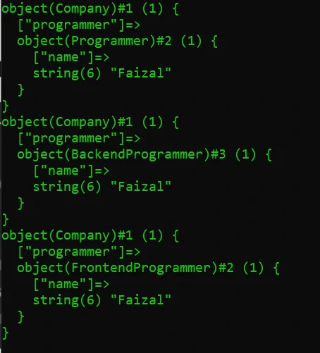
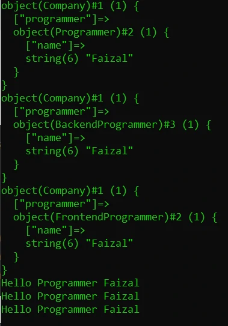

# Polymorphism

## Polymorphism

- Polymorphism berasal dari bahasa Yunani yang berarti banyak bentuk.
- Dalam OOP, Polymorphism adalah kemampuan sebuah object berubah bentuk menjadi bentuk lain
- Polymorphism erat hubungannya dengan Inheritance

---

## Kode : Inheritance

*data/Programmer.php*
```php
<?php

class Programmer
{
    public string $name;

    public function __construct(string $name) {
        $this->name = $name;
    }
}

class BackendProgrammer extends Programmer
{

}

class FrontendProgrammer extends Programmer
{
    
}
```

---

## Kode : Polymorphism

*data/Programmer.php*
```php
<?php

class Programmer
{
    public string $name;

    public function __construct(string $name) {
        $this->name = $name;
    }
}

class BackendProgrammer extends Programmer
{

}

class FrontendProgrammer extends Programmer
{
    
}

class Company
{
    public Programmer $programmer;
}
```

*Polymorphism.php*
```php
<?php

require_once "data/Programmer.php";

$company = new Company();
$company->programmer = new Programmer("Faizal");
var_dump($company);

$company->programmer = new BackendProgrammer("Faizal");
var_dump($company);

$company->programmer = new FrontendProgrammer("Faizal");
var_dump($company);
```

**Hasil :**



---

## Kode : Function Argument Polymorphism

*data/Programmer.php*
```php
<?php

class Programmer
{
    public string $name;

    public function __construct(string $name) {
        $this->name = $name;
    }
}

class BackendProgrammer extends Programmer
{

}

class FrontendProgrammer extends Programmer
{
    
}

class Company
{
    public Programmer $programmer;
}

function sayHelloProgrammer(Programmer $programmer)  {
    echo "Hello Programmer $programmer->name" . PHP_EOL;
}
```

*Polymorphism.php*
```php
<?php

require_once "data/Programmer.php";

$company = new Company();
$company->programmer = new Programmer("Faizal");
var_dump($company);

$company->programmer = new BackendProgrammer("Faizal");
var_dump($company);

$company->programmer = new FrontendProgrammer("Faizal");
var_dump($company);

sayHelloProgrammer(new Programmer("Faizal"));
sayHelloProgrammer(new BackendProgrammer("Faizal"));
sayHelloProgrammer(new FrontendProgrammer("Faizal"));
```

**Hasil :**

