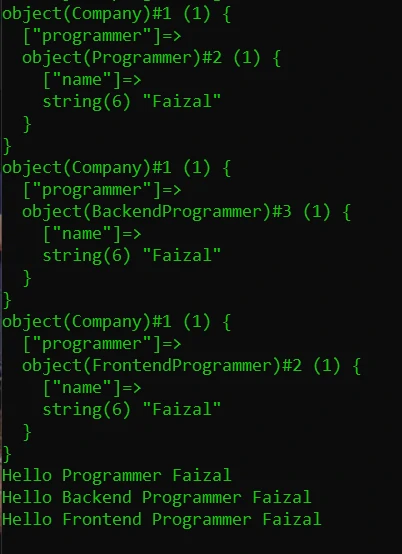

# Type Check & Casts

## Type Check & Casts

- Sebelumnya kita sudah tau cara melakukan konversi tipe data bukan class
- Khusus untuk tipe data object, kita tidak perlu melakukan konversi secara eksplisit
- Namun agar aman, sebelum melakukan casts, pastikan kita melakukan type check (pengecekan tipe data), dengan menggunakan kata kunci instanceof
- Hasil operator instanceof adalah boolean, true jika tipe data sesuai, false jika tidak sesuai

---

## Kode : Type Check & Casts

*data/Programmer.php*
```php
<?php

class Programmer
{
    public string $name;

    public function __construct(string $name) {
        $this->name = $name;
    }
}

class BackendProgrammer extends Programmer
{

}

class FrontendProgrammer extends Programmer
{
    
}

class Company
{
    public Programmer $programmer;
}

function sayHelloProgrammer(Programmer $programmer)  {
    if($programmer instanceof BackendProgrammer) {
        echo "Hello Backend Programmer $programmer->name" . PHP_EOL;
    } else if($programmer instanceof FrontendProgrammer) {
        echo "Hello Frontend Programmer $programmer->name" . PHP_EOL;
    } else if($programmer instanceof Programmer) {
        echo "Hello Programmer $programmer->name" . PHP_EOL;
    }
}
```

*Polymorphism.php*
```php
<?php

require_once "data/Programmer.php";

$company = new Company();
$company->programmer = new Programmer("Faizal");
var_dump($company);

$company->programmer = new BackendProgrammer("Faizal");
var_dump($company);

$company->programmer = new FrontendProgrammer("Faizal");
var_dump($company);

sayHelloProgrammer(new Programmer("Faizal"));
sayHelloProgrammer(new BackendProgrammer("Faizal"));
sayHelloProgrammer(new FrontendProgrammer("Faizal"));
```

**Hasil :**

