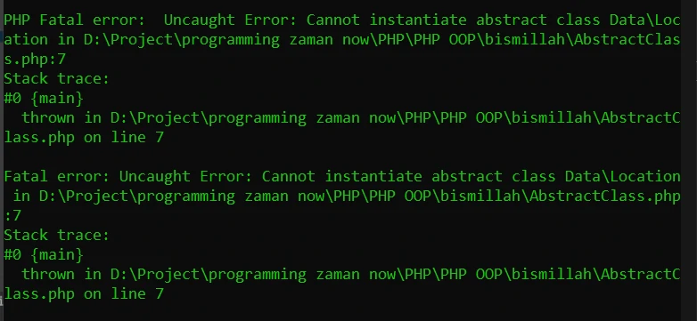

# Abstract Class

## Abstract Class

- Saat kita membuat class, kita bisa menjadikan sebuah class sebagai abstract class.
- Abstract class artinya, class tersebut tidak bisa dibuat sebagai object secara langsung, hanya bisa diturunkan
- Untuk membuat sebuah class menjadi abstract, kita bisa menggunakan kata kunci abstract sebelum kata kunci class
- Sehingga Abstract Class bisa kita gunakan sebagai kontrak child class

---

## Kode : Abstract Class

*Location.php*
```php
<?php

namespace Data;

abstract class Location
{
    public string $name;
}

class city extends Location{}
class Province extends Location{}
class Country extends Location{}
```

---

## Kode : Membuat Abstract Class

### Memaksa membuat object abstract class **ERROR**
*AbstractClass.php*
```php
<?php

require_once "data/Location.php";

use Data\{Location, City, Province, Country};

$Location = new Location(); 
```

**Hasil :**



### yang benar

*AbstractClass.php*
```php
<?php

require_once "data/Location.php";

use Data\{Location, City, Province, Country};

// $Location = new Location(); ERROR

$city = new City();
$province = new Province();
$country = new City();
```