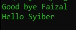
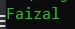

# Trait

## Trait

- Selain class dan interface, di PHP terdapat feature lain bernama trait
- Trait mirip dengan abstract class, kita bisa membuat konkrit function atau abstract function
- Yang membedakan adalah, di trait bisa kita tambahkan ke dalam class lebih dari satu
- Trait mirip seperti ekstension, dimana kita bisa menambahkan konkrit function ke dalam class dengan trait
- Secara sederhana trait adalah digunakan untuk menyimpan function-function yang bisa digunakan ulang di beberapa class
- Untuk menggunakan trait di class, kita bisa menggunakan kata kunci use

---

## Kode : Membuat Trait

*data/SayGoodBye.php*

```php
<?php

namespace Data\Traits;

trait SayGoodBye {
    function goodBye(?string $name): void {
        if(is_null($name)) {
            echo "Good bye" . PHP_EOL;
        } else {
            echo "Good bye $name" . PHP_EOL;
        }
    }
}

trait SayHello {
    function hello(?string $name): void {
        if(is_null($name)) {
            echo "Hello" . PHP_EOL;
        } else {
            echo "Hello $name" . PHP_EOL;
        }
    }
}
```

---

## Kode : Menggunakan Trait

*data/SayGoodBye.php*

```php
class Person {
    use SayGoodBye, SayHello;
}
```

---

## Kode : Akses


```php
<?php

require_once "data/SayGoodBye.php";

use Data\Traits\{Person, SayGoodBye, SayHello};

$person = new Person();
$person->goodBye(("Faizal"));
$person->hello("Syiber");
```


**Hasil :**



---

## Trait Properties
- Berbeda dengan interface, di trait, kita bisa menambahkan properties
- Dengan menambahkan properties, secara otomatis class tersebut akan memiliki properties yang ada di trait

---

## Kode : Trait Properties

*data/SayGoodBye.php*

```php
<?php

namespace Data\Traits;

trait SayGoodBye {
    function goodBye(?string $name): void {
        if(is_null($name)) {
            echo "Good bye" . PHP_EOL;
        } else {
            echo "Good bye $name" . PHP_EOL;
        }
    }
}

trait SayHello {
    function hello(?string $name): void {
        if(is_null($name)) {
            echo "Hello" . PHP_EOL;
        } else {
            echo "Hello $name" . PHP_EOL;
        }
    }
}

trait HasName {
    public string $name;
}

class Person {
    use SayGoodBye, SayHello, HasName;
}
```

---

## Kode : Menggunakan Trait Properties

*Trait.php*

```php
<?php

require_once "data/SayGoodBye.php";

use Data\Traits\{Person, SayGoodBye, SayHello};

$person = new Person();
$person->name = "Faizal";
echo $person->name . PHP_EOL;
```

**Hasil :**

