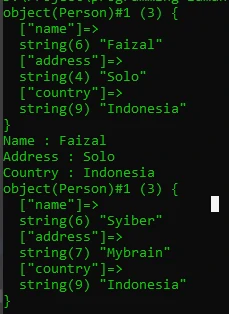
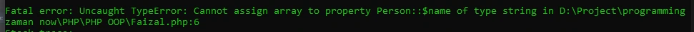
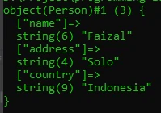
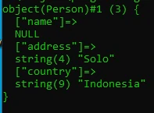

# Properties

## Properties

- Fields / Properties / Attributes adalah data yang bisa kita sisipkan di dalam Object
- Namun sebelum kita bisa memasukkan data di fields, kita harus mendeklarasikan data apa aja yang dimiliki object tersebut di dalam deklarasi class-nya
- Membuat field sama seperti membuat variable, namun ditempatkan di block class, namun diawali dengan kata kunci var

---

## Kode : Properties

*Person.php*
```php
<?php

class Person
{
    var $name;
    var $address;
    var $country;
}
```

---

## Manipulasi Properties

- Fields yang ada di object, bisa kita manipulasi.
- Untuk memanipulasi data field, sama seperti cara pada variable
- Untuk mengakses field, kita butuh kata kunci -> setelah nama object dan diikuti nama fields nya

---

## Kode : Manipulasi Properties

*Faizal.php*
```php
<?php

require_once "data/Person.php";

$person = new Person();
$person->name = "Faizal";
$person->address = "Solo";
$person->country = "Indonesia";

var_dump($person);

echo "Name : $person->name" . PHP_EOL;
echo "Address : $person->address" . PHP_EOL;
echo "Country : $person->country" . PHP_EOL;

$person2 = new Person();
$person->name = "Syiber";
$person->address = "Mybrain";
$person->country = "Indonesia";

var_dump($person);
```

**Hasil :**



---

## Properties Type Declaration

- Sama seperti di function, di properties pun, kita bisa membuat type declaration
- Ini membuat PHP otomatis mengecek tipe data yang sesuai dengan type declaration yang telah ditentukan
- Jika kita mencoba mengubah properties dengan type yang berbeda, maka otomatis akan error
- Ingat, bahwa PHP memiliki fitur type juggling, yang secara otomatis bisa mengkonversi ke tipe data lain
- Untuk menambahkan type declaration, kita bisa tambahkan setelah kata kunci var di properties

---

## Kode : Properties dengan Type

*Person.php*
```php
<?php

class Person
{
    var string $name;
    var string $address;
    var string $country;
}
```

```php
<?php

require_once "data/Person.php";

$person = new Person();
$person->name = [];
```

**Hasil :**



- terjadi error karena sudah kita atur typenya harus string

---

## Default Properties Value

- Sama seperti variable, di properties juga kita bisa langsung mengisi value nya
- Ini mirip seperti default value, jadi jika tidak diubah di object, maka properties akan memiliki value tersebut

---

## Kode : Properties Default Value

*Person.php*
```php
<?php

class Person
{
    var string $name;
    var string $address;
    var string $country = "Indonesia";
}
```

*Faizal.php*
```php
<?php

require_once "data/Person.php";

$person = new Person();
$person->name = "Faizal";
$person->address = "Solo";

var_dump($person);
```

**Hasil :**


---

## Nullable Properties

- Saat kita menambah type declaration di properties atau di function argument, maka secara otomatis kita tidak bisa mengirim data null ke dalam properties atau function argument tersebut
- Di PHP 7.4 dikenalkan nullable type, jadi kita bisa mengirim data null ke properties atau function arguments
- Caranya sebelum type declaration nya, kita bisa tambahkan tanda ?

---

## Kode : Nullable Properties

*Faizal.php*
```php
<?php

require_once "data/Person.php";

$person = new Person();
$person->name = null;
$person->address = "Solo";

var_dump($person);
```

*Person.php*
```php
<?php

class Person
{
    var ?string $name;
    var ?string $address = null;
    var string $country = "Indonesia";
}
```

**Hasil :**

