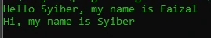

# this Keyword

# This Keyword

- Saat kita membuat kode di dalam function di dalam class, kita bisa menggunakan kata kunci this untuk mengakses object saat ini
- Misal kadang kita butuh mengakses properties atau function lain di class yang sama

---

## Kode : This Keyword

*Faizal.php*
```php
<?php

require_once "data/Person.php";

$faizal = new Person();
$faizal -> name = "Faizal";
$faizal -> sayHello("Syiber");

$syiber = new Person();
$syiber -> name = "Syiber";
$syiber -> sayHello(null);
```

*Person.php*
```php
<?php

class Person
{
    var ?string $name;
    var ?string $address = null;
    var string $country = "Indonesia";

    function sayHello(?string $name)
    {
        if(is_null($name)) {
            echo "Hi, my name is $this->name" . PHP_EOL;
        } else {
            echo "Hello $name, my name is $this->name" . PHP_EOL;
        }
    }
}
```

**Hasil :**

