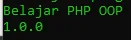

# Constant

## Constant

- Properties di class bisa diubah, mirip seperti variable
- Di class juga kita membuat constant, data yang tidak bisa diubah
- Di materi PHP Dasar, kita belajar untuk membuat constant itu perlu menggunakan function define()
- Namun sejak PHP 7.4, kita bisa menggunakan kata kunci const untuk membuat constant, mirip seperti variable, namun tidak menggunakan karakter $

---

## Kode : Constant

*Faizal.php*
```php
<?php

define("APPLICATION", "Belajar PHP OOP");
const APP_VERSION = "1.0.0";

echo APPLICATION . PHP_EOL;
echo APP_VERSION . PHP_EOL;
```

**Hasil :**



---

## Kode : Constant di Class

*Person.php*
```php
<?php

class Person
{
    const AUTHOR = "Program Is Fun";

    var string $name;
    var ?string $address = null;
    var string $country = "Indonesia";

    function sayHello(?string $name)
    {
        if(is_null($name)) {
            echo "Hi, my name is $this->name" . PHP_EOL;
        } else {
            echo "Hello $name, my name is $this->name" . PHP_EOL;
        }
    }
}
```

---

## Kode : Mengakses Constant di Class

*Faizal.php*
```php
<?php

require_once "data/Person.php";

define("APPLICATION", "Belajar PHP OOP");
const APP_VERSION = "1.0.0";

echo APPLICATION . PHP_EOL;
echo APP_VERSION . PHP_EOL;
echo Person::AUTHOR . PHP_EOL;
```