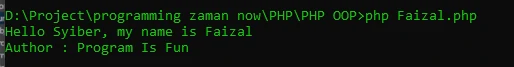

# self Keyword

## Properties vs Constant

- Saat kita membuat object, properties yang terdapat di class akan secara otomatis dibuat per object, oleh karena itu untuk mengakses properties, kita perlu menggunakan object, atau jika dari dalam object tersebut sendiri, kita perlu menggunakan kata kunci this
- Sedangkan berbeda dengan constant, constant di class tidak akan dibuat per object. Constant itu hidupnya di class, bukan di object, oleh karena itu untuk mengaksesnya kita perlu menggunakan NamaClass::NAMA_CONSTANT
- Secara sederhana, properties akan dibuat satu per instance class (**object**), sedangkan constant dibuat satu per class

---

## self Keyword

- Jika di dalam class (misal di function) kita ingin mengakses constant, kita perlu mengakses menggunakan NamaClass::NAMA_CONSTANT
- Namun jika di dalam class yang sama, kita bisa menggunakan kata kunci self untuk mempermudah

---

## Kode : self Keyword

```php

*Person.php*
<?php
class Person
{
    const AUTHOR = "Program Is Fun";

    var string $name;
    var ?string $address = null;
    var string $country = "Indonesia";

    function sayHello(?string $name)
    {
        if(is_null($name)) {
            echo "Hi, my name is $this->name" . PHP_EOL;
        } else {
            echo "Hello $name, my name is $this->name" . PHP_EOL;
        }
    }

    function info() {
        // tanpa self
        // echo "Author : " . Person::AUTHOR . PHP_EOL;
        echo "Author : " . self::AUTHOR . PHP_EOL;
    }
}
```

*Faizal.php*
```php
<?php

require_once "data/Person.php";


$faizal = new Person();
$faizal->name = "Faizal";
$faizal->sayHello("Syiber");
$faizal->info();
```

**Hasil :**

