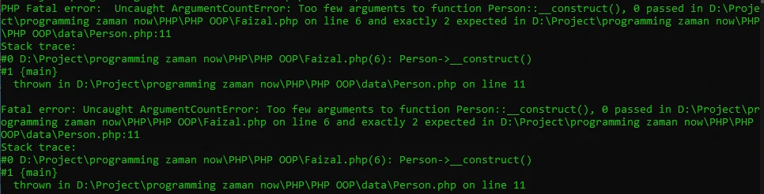
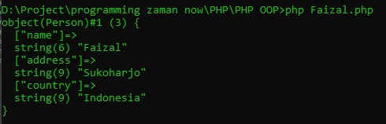

# Constructor

## Constructor
- Saat kita membuat Object, maka kita seperti memanggil sebuah function, karena kita menggunakan kurung ()
- Di dalam class PHP, kita bisa membuat constructor, constructor adalah function yang akan dipanggil saat pertama kali Object dibuat.
- Mirip seperti di function, kita bisa memberi parameter pada constructor
- Nama constructor di PHP haruslah __construct()

---

## Kode : Membuat Constructor

*Data/Person.php*
```php
<?php

class Person
{
    const AUTHOR = "Program Is Fun";

    var string $name;
    var ?string $address = null;
    var string $country = "Indonesia";

    function __construct(string $name, ?string $address)  {
        $this->name = $name;
        $this->address = $address;
    }

    function sayHello(?string $name)
    {
        if(is_null($name)) {
            echo "Hi, my name is $this->name" . PHP_EOL;
        } else {
            echo "Hello $name, my name is $this->name" . PHP_EOL;
        }
    }

    function info() {
        // tanpa self
        // echo "Author : " . Person::AUTHOR . PHP_EOL;
        echo "Author : " . self::AUTHOR . PHP_EOL;
    }
}
```

> wajib memasukkan parameter
> jika tidak maka akan error



*Faizal.php*
---

## Kode : Menggunakan Constructor

```php
<?php

require_once "data/Person.php";

$faizal = new Person("Faizal", "Sukoharjo");
var_dump($faizal);
```

**Hasil :**

